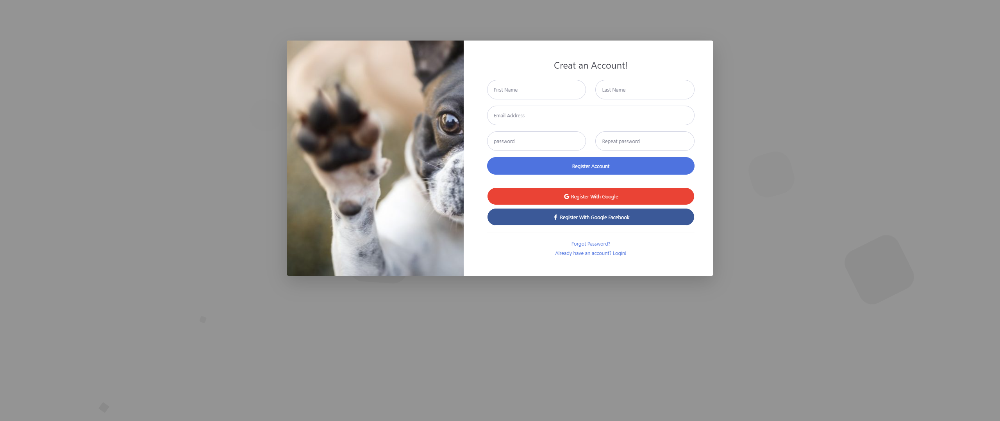

<h2 align="center">Happy Paws Signup Form</h2>
</br>

<div align="center">
<a href="https://github.com/SidneyTeodoroJr" target="_blank">

</a>
</div>
</br>
</br>

This is a repository for an application form developed for Happy Paws, a fictional local animal shelter. The form is used to collect information from people interested in adopting a pet.
</br>

## How to use
</br>

To use the Happy Paws sign-up form, please follow the steps below:

1. Clone this repository to your local machine using the following command:

   ```shell
   git clone https://github.com/SidneyTeodoroJr/happy_paws_signup_form.git
   
2. Navigate to the cloned directory:

   ```shell
   cd happy_paws_signup_form

3. Open the "index.html" file in a web browser.
</br>

## Contribution
</br>

If you would like to contribute to the development of the Happy Paws application form, please follow the steps below:

1. Fork this repository and clone it to your local machine.

   ```shell
   git clone https://github.com/SEU_USUARIO/happy_paws_signup_form.git

2. Create a new branch for your changes:

   ```shell
   git checkout -b minha-branch

3. Make the desired changes to the code.

4. Commit your changes:

   ```shell
   git commit -m "Minhas alterações"

5. Push your changes to the remote repository:

   ```shell
   git push origin minha-branch

6. Open a pull request on the original repository.
</br>

## Autor
</br>

This Happy Paws application form was developed by [Sidney Teodoro Jr](https://github.com/SidneyTeodoroJr).

##
</br>

<div align="center">
<a href="https://www.facebook.com/profile.php?id=100091086461235" target="_blank"></a>
<a href="https://www.instagram.com/sidneyteodoroaraujo" target="_blank">
<a href="https://www.linkedin.com/in/sidney-teodoro-4a4a8119b?lipi=urn%3Ali%3Apage%3Ad_flagship3_profile_view_base_contact_details%3B%2FevuTOiSSJS2hWGCZgtZiQ%3D%3D" target="_blank"></a>
</div>
